# ExploreSingapore Application - Use Cases and Requirements

## Table of Contents

1. [Executive Summary](#executive-summary)
2. [System Overview](#system-overview)
3. [UML Diagrams](#uml-diagrams)
   - [Physical Architecture Diagram](#physical-architecture-diagram)
   - [Logical Architecture Diagram](#logical-architecture-diagram)
   - [Use Case Diagrams](#use-case-diagrams)
   - [Sequence Diagrams](#sequence-diagrams)
   - [Component Diagram](#component-diagram)
   - [Deployment Diagram](#deployment-diagram)
4. [User Roles & Personas](#user-roles--personas)
5. [Functional Requirements](#functional-requirements)
6. [Detailed Use Cases](#detailed-use-cases)
7. [Non-Functional Requirements](#non-functional-requirements)
8. [Technical Requirements](#technical-requirements)
9. [Business Rules](#business-rules)
10. [Security Requirements](#security-requirements)
11. [Integration Requirements](#integration-requirements)

---

## Executive Summary

**ExploreSingapore** is a comprehensive web-based platform designed to help tourists and locals discover Singapore's attractions, events, dining experiences, and car rental services. The application combines tourism information with a sophisticated car rental system featuring fleet management, real-time vehicle tracking, multi-step booking workflow, role-based access control, and Google OAuth authentication.

**Primary Objectives:**

- Provide tourists with a one-stop platform for exploring Singapore
- Offer seamless car rental booking experience with real-time availability
- Enable fleet operators to manage their vehicle inventory efficiently
- Support multiple user roles with granular permissions
- Deliver personalized experiences based on user preferences

**Key Metrics:**

- Target Users: International tourists, local residents, fleet managers, system administrators
- Supported Operators: Multiple car rental companies (Hertz, Budget, Avis, etc.)
- Vehicle Inventory: 100+ vehicles across multiple categories
- Booking Success Rate: >95%
- System Uptime: 99.9%

---

## System Overview

### Application Type

Single Page Application (SPA) built with React 19, TypeScript, and Vite

### Core Modules

1. **Tourism Discovery Module** - Attractions, Food, Events, Explore (Maps)
2. **Authentication & User Management** - Google OAuth, Profile Management
3. **Car Rental System** - Vehicle Browsing, Booking Flow, Add-ons
4. **Fleet Management System** - Dashboard Analytics, Inventory Management, GPS Tracking
5. **Personalization Module** - Your Day Dashboard, Weather Integration
6. **Administration Module** - User Management, System Configuration

### Deployment Architecture

- **Frontend**: React SPA served via Nginx (Production) / Vite Dev Server (Development)
- **Authentication**: Google OAuth 2.0 with JWT tokens
- **API Integration**: RESTful APIs with Bearer token authentication
- **Real-Time Data**: WebSocket support for GPS tracking (Eagle IoT)
- **Mapping**: Mapbox GL for interactive maps
- **Containerization**: Docker with multi-stage builds

---

## UML Diagrams

### Physical Architecture Diagram

This diagram shows the physical deployment architecture of the ExploreSingapore application, including all infrastructure components, external services, and network boundaries.

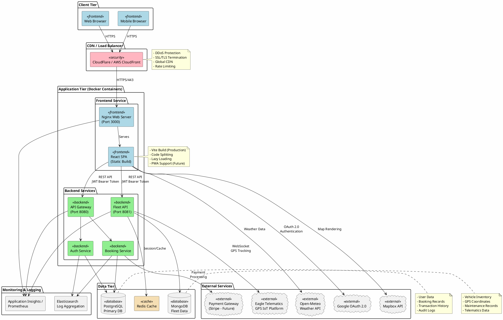

---

### Logical Architecture Diagram

This diagram illustrates the logical layers and components of the application, showing how different modules interact.

```plantuml
@startuml Logical Architecture
!include https://raw.githubusercontent.com/plantuml-stdlib/C4-PlantUML/master/C4_Component.puml

LAYOUT_WITH_LEGEND()

title Logical Architecture - ExploreSingapore Application

Container_Boundary(spa, "Single Page Application") {
    Component(ui, "UI Components", "React 19", "Reusable UI components using Tailwind CSS")
    Component(pages, "Page Components", "React Router", "Route-based page components")
    Component(contexts, "State Management", "React Context", "Global state (Auth, Booking, Fleet)")
    Component(services, "API Services", "Axios", "HTTP client for backend communication")
    Component(utils, "Utilities", "TypeScript", "Helper functions, formatters, validators")
}

Container_Boundary(auth, "Authentication Module") {
    Component(oauth, "Google OAuth", "@react-oauth/google", "OAuth 2.0 authentication")
    Component(jwt, "JWT Handler", "Custom", "Token management and validation")
    Component(rbac, "RBAC Engine", "Custom", "Role-based access control")
}

Container_Boundary(rental, "Car Rental Module") {
    Component(browse, "Vehicle Browser", "React", "Search, filter, and browse vehicles")
    Component(booking, "Booking Flow", "React Router State", "Multi-step booking process")
    Component(addons, "Add-ons Manager", "React", "Insurance and extras selection")
    Component(payment, "Payment Handler", "Future: Stripe", "Payment processing")
}

Container_Boundary(fleet, "Fleet Management Module") {
    Component(dashboard, "Analytics Dashboard", "Chart.js", "Fleet statistics and charts")
    Component(inventory, "Inventory Manager", "TanStack Table", "Vehicle list and management")
    Component(tracking, "GPS Tracking", "Mapbox GL", "Real-time vehicle tracking")
    Component(eagle, "Eagle Integration", "WebSocket", "IoT telematics integration")
}

Container_Boundary(tourism, "Tourism Discovery Module") {
    Component(attractions, "Attractions", "React", "Singapore attractions catalog")
    Component(food, "Food & Dining", "React", "Restaurant and hawker info")
    Component(events, "Events", "React", "Events and festivals")
    Component(explore, "Interactive Map", "Mapbox GL", "Explore Singapore with map")
}

Container_Boundary(personalization, "Personalization Module") {
    Component(yourday, "Your Day", "React", "Personalized dashboard")
    Component(weather, "Weather Widget", "Open-Meteo API", "Real-time weather")
    Component(profile, "Profile Manager", "React", "User preferences and settings")
}

Container_Boundary(backend, "Backend Services") {
    Component(api, "API Gateway", "REST", "Main API endpoint")
    Component(fleetapi, "Fleet API", "REST", "Fleet-specific endpoints")
    Component(authsvc, "Auth Service", "JWT", "Authentication and authorization")
    Component(bookingsvc, "Booking Service", "REST", "Booking management")
}

Container_Boundary(external, "External Services") {
    ComponentDb(google, "Google OAuth", "OAuth 2.0", "User authentication")
    ComponentDb(mapbox, "Mapbox API", "REST", "Maps and geocoding")
    ComponentDb(openmeteo, "Open-Meteo", "REST", "Weather data")
    ComponentDb(eagleiot, "Eagle IoT", "WebSocket", "GPS tracking")
}

' Relationships
Rel(pages, ui, "Uses")
Rel(pages, contexts, "Accesses")
Rel(pages, services, "Calls")
Rel(services, utils, "Uses")

Rel(pages, oauth, "Authenticates")
Rel(oauth, jwt, "Issues")
Rel(jwt, rbac, "Validates")

Rel(pages, browse, "Displays")
Rel(pages, booking, "Executes")
Rel(booking, addons, "Includes")
Rel(booking, payment, "Processes")

Rel(pages, dashboard, "Shows")
Rel(pages, inventory, "Manages")
Rel(pages, tracking, "Displays")
Rel(tracking, eagle, "Integrates")

Rel(pages, attractions, "Shows")
Rel(pages, food, "Shows")
Rel(pages, events, "Shows")
Rel(pages, explore, "Renders")

Rel(pages, yourday, "Displays")
Rel(yourday, weather, "Shows")
Rel(yourday, profile, "Uses")

Rel(services, api, "Calls")
Rel(services, fleetapi, "Calls")
Rel(api, authsvc, "Routes to")
Rel(api, bookingsvc, "Routes to")

Rel(oauth, google, "Authenticates with")
Rel(explore, mapbox, "Loads tiles from")
Rel(tracking, mapbox, "Renders with")
Rel(weather, openmeteo, "Fetches from")
Rel(eagle, eagleiot, "Streams from")

@enduml
```

---

### Use Case Diagrams

#### Overall System Use Case Diagram

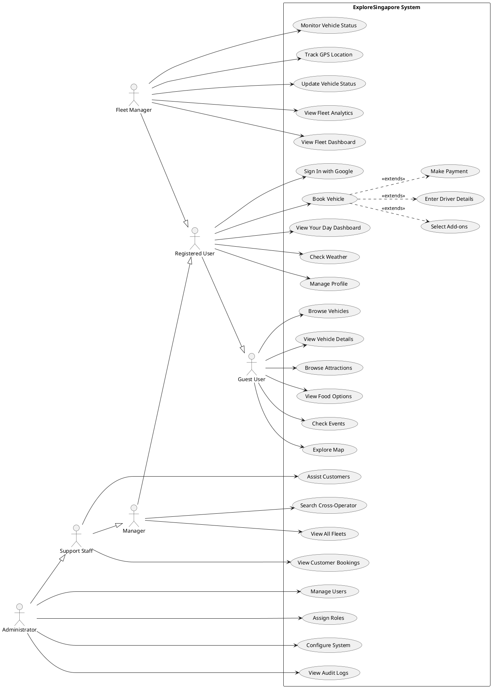

#### Car Rental Booking Use Case Diagram

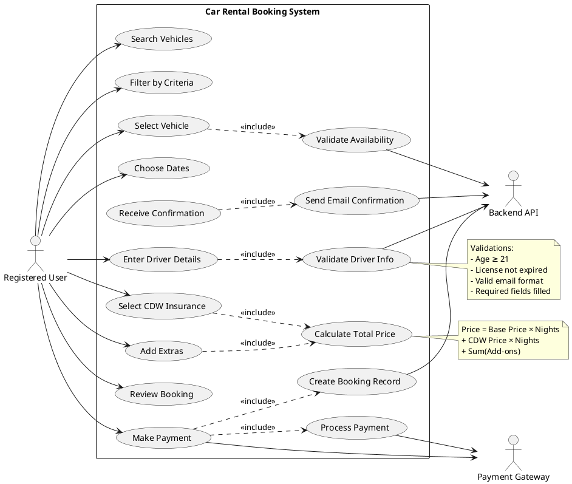

#### Fleet Management Use Case Diagram

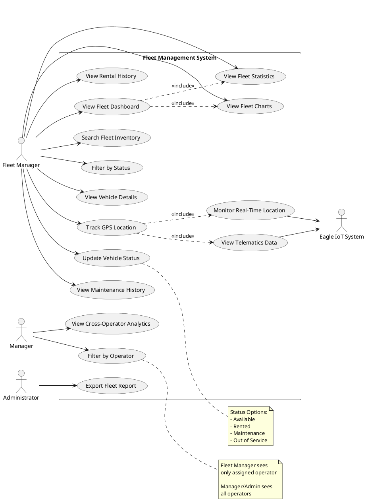

---

### Sequence Diagrams

#### Authentication Flow Sequence Diagram

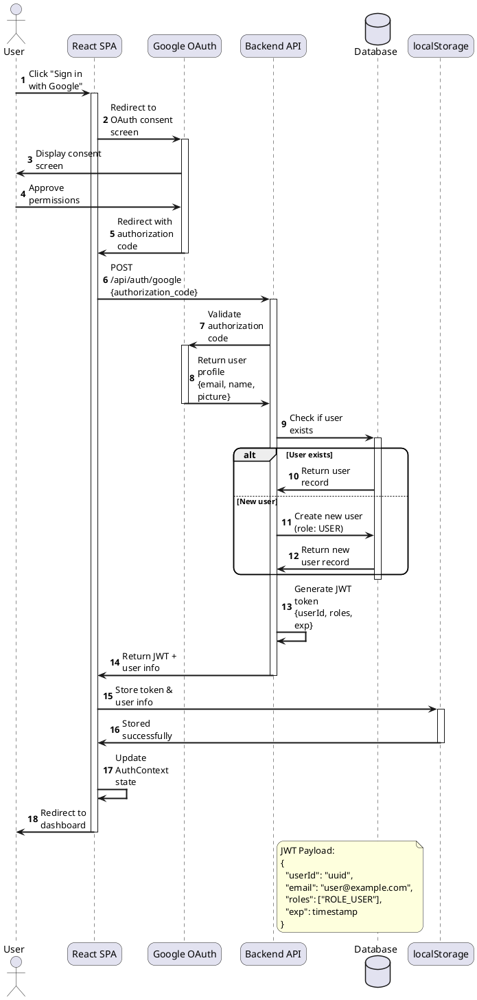

#### Vehicle Booking Flow Sequence Diagram

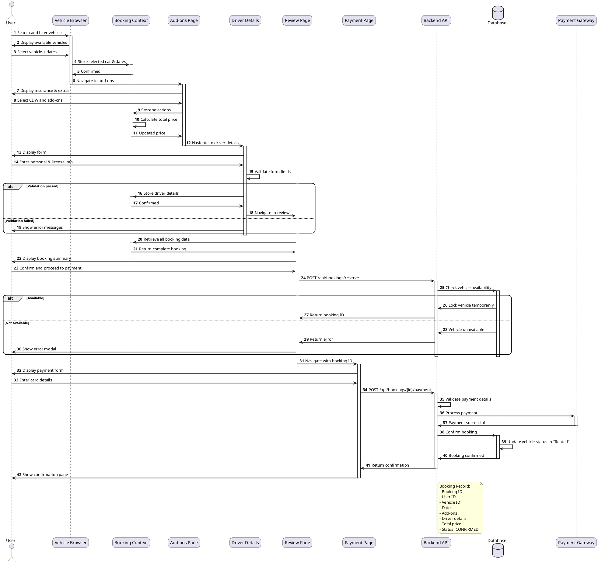

#### Fleet GPS Tracking Sequence Diagram

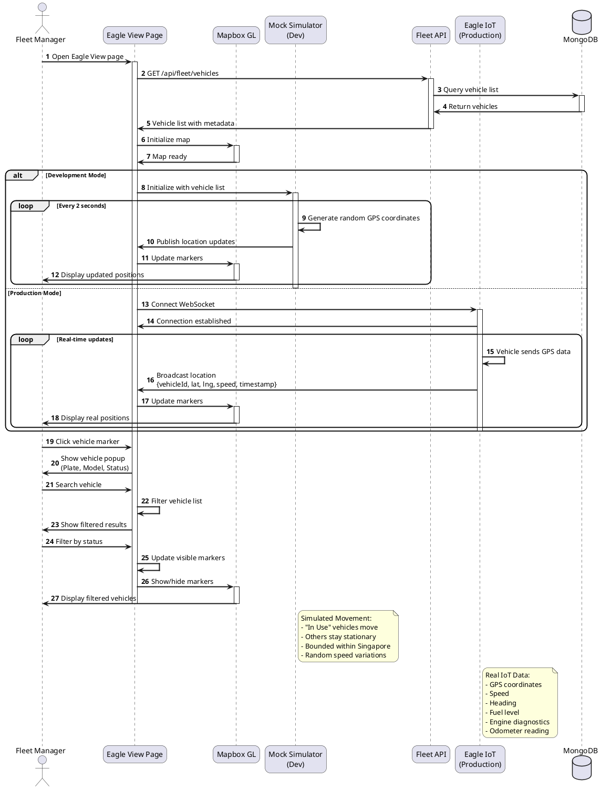

#### RBAC Authorization Sequence Diagram

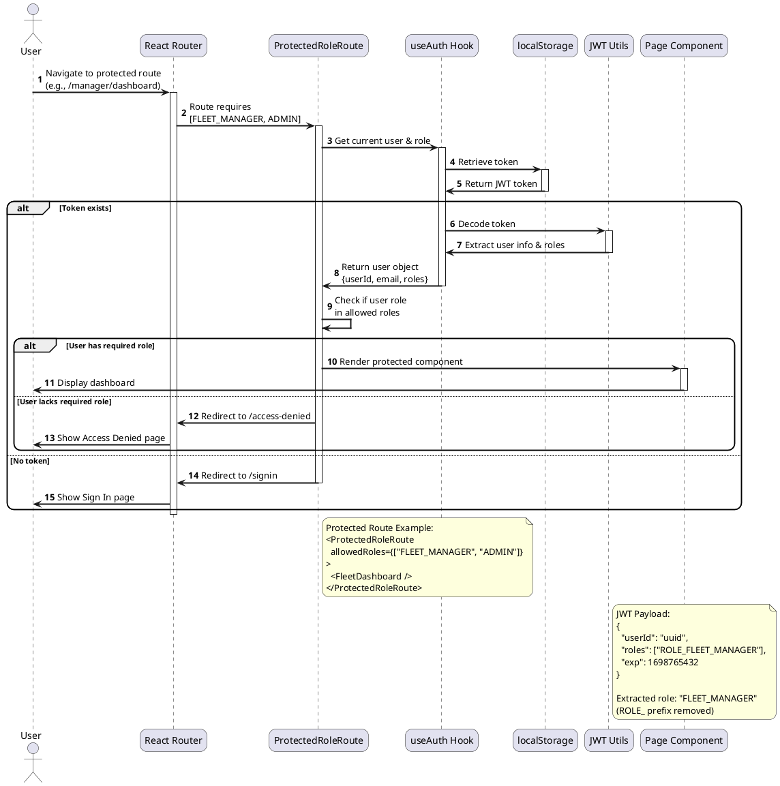

---

### Component Diagram

This diagram shows the internal structure of the React application with its components and dependencies.

```plantuml
@startuml Component Diagram
!include https://raw.githubusercontent.com/plantuml-stdlib/C4-PlantUML/master/C4_Component.puml

LAYOUT_LEFT_RIGHT()

title Component Diagram - React Application Structure

Container_Boundary(app, "React Application") {

    Component(router, "React Router", "react-router-dom@7.9", "Client-side routing")
    Component(app_comp, "App Component", "React", "Root component with routing")

    Container_Boundary(contexts, "Context Providers") {
        Component(auth_ctx, "AuthContext", "React Context", "Authentication state")
        Component(booking_ctx, "BookingContext", "React Context", "Booking flow state")
        Component(fleet_ctx, "FleetContext", "React Context", "Fleet data state")
        Component(loading_ctx, "LoadingContext", "React Context", "Loading state")
    }

    Container_Boundary(pages, "Page Components") {
        Component(home, "HomePage", "React", "Landing page")
        Component(browse, "UserVehicleBrowsePage", "React", "Vehicle catalog")
        Component(booking_flow, "BookingFlow", "React", "Multi-step booking")
        Component(yourday, "YourDayPage", "React", "Personalized dashboard")
        Component(fleet_dash, "FleetAdminDashboardPage", "React", "Fleet analytics")
        Component(fleet_list, "FleetAdminListPage", "React", "Fleet inventory")
        Component(eagle, "EagleViewPage", "React", "GPS tracking")
        Component(admin, "AdminConsole", "React", "Admin panel")
    }

    Container_Boundary(components, "Shared Components") {
        Component(navbar, "Navbar", "React", "Navigation bar")
        Component(footer, "Footer", "React", "Page footer")
        Component(rental_card, "RentalCard", "React", "Vehicle card")
        Component(fleet_table, "FleetTable", "TanStack Table", "Fleet data table")
        Component(weather, "WeatherWidget", "React", "Weather display")
        Component(vehicle_drawer, "VehicleDrawer", "React", "Vehicle details panel")
        Component(protected_route, "ProtectedRoleRoute", "React", "RBAC guard")
    }

    Container_Boundary(services, "API Services") {
        Component(api_client, "Axios Client", "axios@1.12", "HTTP client")
        Component(booking_api, "Booking API", "TypeScript", "Booking endpoints")
        Component(fleet_api, "Fleet API", "TypeScript", "Fleet endpoints")
        Component(auth_service, "Auth Service", "TypeScript", "Auth endpoints")
    }

    Container_Boundary(utils, "Utilities") {
        Component(jwt_utils, "JWT Utils", "TypeScript", "Token parsing")
        Component(rental_utils, "Rental Utils", "TypeScript", "Formatting helpers")
        Component(validators, "Validators", "TypeScript", "Form validation")
    }

    Container_Boundary(hooks, "Custom Hooks") {
        Component(use_auth, "useAuth", "React Hook", "Auth context accessor")
        Component(use_booking, "useBooking", "React Hook", "Booking context accessor")
        Component(use_fleet, "useFleetData", "React Hook", "Fleet data fetcher")
    }
}

Container_Boundary(external_libs, "External Libraries") {
    Component(react, "React@19.1", "Library", "UI framework")
    Component(oauth, "@react-oauth/google", "Library", "Google OAuth")
    Component(mapbox, "mapbox-gl@3.15", "Library", "Map rendering")
    Component(chartjs, "chart.js@4.5", "Library", "Data visualization")
    Component(gsap, "GSAP@3.13", "Library", "Animations")
    Component(tailwind, "Tailwind CSS@4.1", "Framework", "Styling")
}

' Relationships
Rel(app_comp, router, "Uses")
Rel(app_comp, auth_ctx, "Wraps with")
Rel(app_comp, booking_ctx, "Wraps with")

Rel(router, pages, "Routes to")
Rel(pages, components, "Renders")
Rel(pages, contexts, "Consumes")
Rel(pages, hooks, "Uses")

Rel(components, hooks, "Uses")
Rel(hooks, contexts, "Accesses")

Rel(pages, services, "Calls")
Rel(services, api_client, "Uses")
Rel(services, utils, "Uses")

Rel(auth_ctx, jwt_utils, "Uses")
Rel(auth_ctx, oauth, "Integrates")

Rel(eagle, mapbox, "Renders with")
Rel(fleet_dash, chartjs, "Visualizes with")
Rel(home, gsap, "Animates with")

Rel(components, tailwind, "Styled with")

@enduml
```

---

### Deployment Diagram

This diagram shows how the application is deployed in different environments.

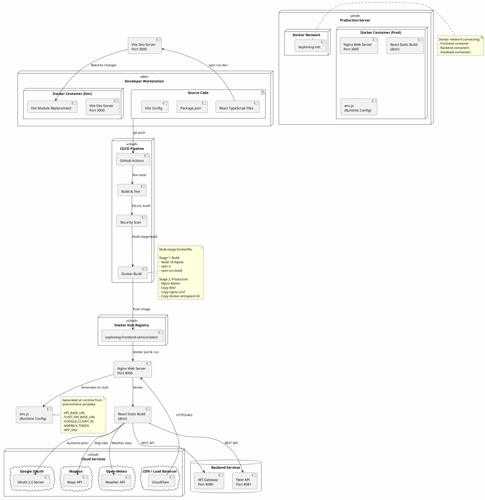

---

### State Diagram - Booking Flow

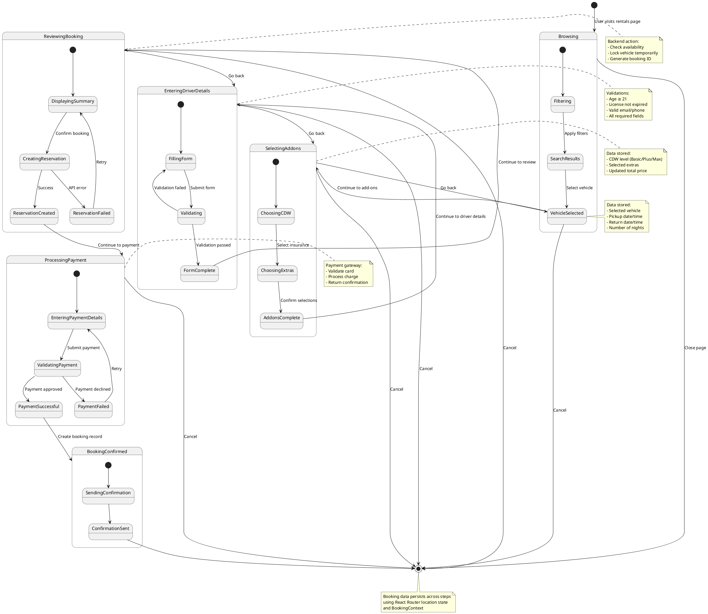

---

### Class Diagram - Core Data Models

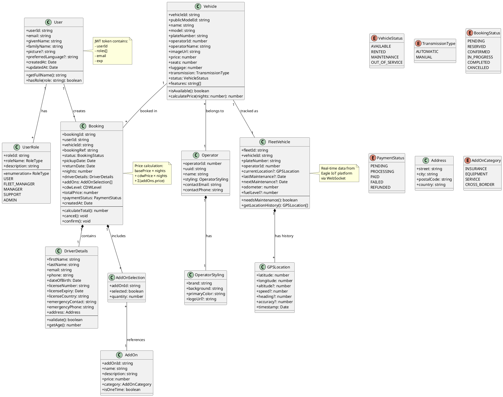

---

## User Roles & Personas

### 1. Guest User (Unauthenticated)

**Description:** Visitors exploring the platform without signing in

**Capabilities:**

- Browse attractions, food, events, and explore pages
- View available rental vehicles with filters
- Access company information (About page)
- Cannot make bookings or access personalized features

**User Story:**

> "As a tourist planning my Singapore trip, I want to explore attractions and see available rental cars without creating an account, so I can decide if the platform meets my needs."

---

### 2. Registered User (USER)

**Description:** Authenticated users who can make bookings and access personalized features

**Capabilities:**

- All guest capabilities
- Sign in with Google OAuth
- Browse and book rental vehicles
- Complete multi-step booking process
- View personalized "Your Day" dashboard
- Manage profile information
- View booking history (future feature)
- Access weather information

**Restrictions:**

- Cannot access fleet management features
- Cannot view other users' bookings
- New signups are automatically assigned USER role

**User Story:**

> "As a tourist visiting Singapore, I want to book a rental car easily with my Google account, so I can have transportation during my stay without complex registration."

---

### 3. Fleet Manager (FLEET_MANAGER)

**Description:** Operators managing specific car rental company fleets

**Capabilities:**

- All USER capabilities
- View operator-specific fleet dashboard with analytics
- Manage assigned fleet inventory
- Track vehicles with Eagle GPS integration
- View fleet statistics and charts
- Monitor vehicle status (Available, Rented, Maintenance)
- Access operator-branded interface

**Restrictions:**

- Can only view/manage vehicles from assigned operator
- Cannot access admin console
- Cannot modify other operators' fleets

**Operator Mapping:**

- Hertz: UUID `92f04715-b828-4fc0-9013-81c3b468fcf1`
- Budget: UUID `3ab592e6-6cf1-45e8-b97d-4e5d0f8a92c3`
- Avis: UUID `7f2d8e9a-1c4b-4a6d-9e3f-5b8c7a1d4e2f`

**User Story:**

> "As a Hertz fleet manager, I want to see real-time status of my vehicles and track their GPS locations, so I can optimize fleet utilization and respond to maintenance needs quickly."

---

### 4. Manager (MANAGER)

**Description:** Cross-operator managers with oversight capabilities

**Capabilities:**

- All USER capabilities
- View all fleets across operators
- Search and filter entire vehicle inventory
- Access comprehensive fleet lists
- View analytics across operators

**Restrictions:**

- Cannot modify fleet data
- Cannot access admin console

**User Story:**

> "As a regional manager, I want to view vehicle availability across all rental operators, so I can analyze market supply and make strategic decisions."

---

### 5. Support Staff (SUPPORT)

**Description:** Customer support personnel assisting users

**Capabilities:**

- All MANAGER capabilities
- View customer bookings
- Access support tools
- Assist with troubleshooting

**Restrictions:**

- Cannot modify system configuration
- Cannot create/delete users

**User Story:**

> "As a support agent, I want to view customer booking details and vehicle status, so I can help resolve issues quickly."

---

### 6. Administrator (ADMIN)

**Description:** System administrators with full access

**Capabilities:**

- All permissions across the system
- Access admin console
- User management (create, modify, delete)
- Assign roles to users
- System configuration
- Full Eagle tracking access
- Cross-operator analytics
- View audit logs (future feature)

**User Story:**

> "As a system administrator, I want to manage user roles and monitor system health, so I can ensure smooth operations and security compliance."

---

## Functional Requirements

### FR-1: Authentication & Authorization

#### FR-1.1: Google OAuth Authentication

**Priority:** High  
**Status:** Implemented

**Requirements:**

- Users must be able to sign in using Google OAuth 2.0
- System must extract user information from Google profile (email, name, picture)
- JWT token must be issued upon successful authentication
- Token must contain userId, roles, and expiration time
- Token must be stored in localStorage and React Context
- Session must persist across page refreshes

**Acceptance Criteria:**

- User clicks "Sign in with Google" button
- Google consent screen appears
- Upon approval, user is redirected back with profile data
- JWT token is stored and user is authenticated
- Navigation bar reflects authenticated state

---

#### FR-1.2: Role-Based Access Control (RBAC)

**Priority:** High  
**Status:** Implemented

**Requirements:**

- System must support 5 distinct roles: USER, FLEET_MANAGER, MANAGER, SUPPORT, ADMIN
- Routes must be protected based on role permissions
- New user registrations must default to USER role only
- Role elevation must only be possible through backend/admin
- Unauthorized access attempts must redirect to Access Denied page

**Role Permission Matrix:**

| Feature            | USER | FLEET_MGR | MANAGER | SUPPORT | ADMIN   |
| ------------------ | ---- | --------- | ------- | ------- | ------- |
| Browse Vehicles    | ✓    | ✓         | ✓       | ✓       | ✓       |
| Make Bookings      | ✓    | ✓         | ✓       | ✓       | ✓       |
| Your Day Page      | ✓    | ✓         | ✓       | ✓       | ✓       |
| Fleet Dashboard    | ✗    | ✓ (own)   | ✓ (all) | ✓ (all) | ✓ (all) |
| Eagle GPS Tracking | ✗    | ✓ (own)   | ✗       | ✗       | ✓ (all) |
| Admin Console      | ✗    | ✗         | ✗       | ✗       | ✓       |
| User Management    | ✗    | ✗         | ✗       | ✗       | ✓       |

**Acceptance Criteria:**

- Correct routes are accessible based on user role
- Attempting to access unauthorized route redirects to /access-denied
- Navigation menu shows only permitted links

---

### FR-2: Vehicle Browsing & Search

#### FR-2.1: Vehicle Catalog Display

**Priority:** High  
**Status:** Implemented

**Requirements:**

- Display all available rental vehicles in card format
- Each card must show: image, name, price, seats, luggage, transmission
- Support grid layout responsive to screen size
- Show availability status
- Display operator branding

**Acceptance Criteria:**

- Vehicle cards render with all information
- Images load correctly with fallback for missing images
- Price displays in Singapore Dollars (S$)
- Operator logo/badge visible on each card

---

#### FR-2.2: Advanced Filtering System

**Priority:** High  
**Status:** Implemented

**Requirements:**

- Filter by price range (S$0 - S$1000+)
- Filter by vehicle type (Sedan, SUV, Luxury, Hybrid, MPV, Compact)
- Filter by seating capacity (2, 4, 5, 7+ seats)
- Filter by transmission (Automatic, Manual)
- Real-time search by vehicle name/model
- Sorting: Price (Low-High, High-Low), Brand (A-Z, Z-A)
- Filters must work in combination
- Results must update instantly without page reload

**Acceptance Criteria:**

- Applying filters immediately updates vehicle list
- Clearing filters restores full catalog
- Search box filters by name with partial matching
- No results state displays appropriate message
- Filter count shows number of active filters

---

#### FR-2.3: Date & Time Selection

**Priority:** High  
**Status:** Implemented

**Requirements:**

- Users can select pickup date and time
- Users can select return date and time
- Minimum rental period: 1 day
- Calculate number of nights automatically
- Validate return date is after pickup date
- Store dates in booking context

**Acceptance Criteria:**

- Date picker prevents past dates
- Time selection uses dropdown or time picker
- Invalid date ranges show error message
- Number of nights calculates correctly
- Dates persist when navigating booking flow

---

### FR-3: Booking Flow

#### FR-3.1: Multi-Step Booking Process

**Priority:** High  
**Status:** Implemented

**Booking Steps:**

1. **Vehicle Selection** (`/rentals`)
2. **Add-ons Selection** (`/booking/:carId/addons`)
3. **Driver Details** (`/booking/:carId/driver-details`)
4. **Review Booking** (`/booking/:carId/review`)
5. **Payment** (`/booking/:carId/:bookingId/payment`)
6. **Confirmation** (`/booking/:carId/:bookingId/confirmation`)

**Requirements:**

- Progress indicator must show current step
- Users can navigate back to previous steps
- Data must persist across steps using React Router state and BookingContext
- Users must complete steps in sequence
- Skip to payment not allowed without completing prior steps

**Acceptance Criteria:**

- Progress bar highlights current step
- Back button navigates to previous step without data loss
- Next button validates current step before proceeding
- Skipping steps redirects to first incomplete step

---

#### FR-3.2: Add-ons Selection

**Priority:** Medium  
**Status:** Implemented

**Available Add-ons:**

**Insurance Options (CDW - Collision Damage Waiver):**

- **CDW Basic** - Included (S$0)
- **CDW Plus** - Additional coverage (+S$18/night)
- **CDW Max** - Maximum coverage (+S$40/night)

**Additional Services:**

- Malaysia Entry Permission - FREE
- Windscreen Damage Protection - S$20 (one-time)
- Malaysia Breakdown Protection - S$30 (one-time)
- Child Booster Seat - S$25 (one-time)
- NETS Cash Card Rental - S$20 (one-time)

**Requirements:**

- User must select one CDW option (default: Basic)
- User can select multiple additional services
- Price must update in real-time as selections change
- Total price calculation includes base price + CDW + add-ons × nights

**Acceptance Criteria:**

- Selecting add-ons updates price immediately
- Price breakdown shows base price, CDW, and add-ons separately
- Deselecting add-ons reduces price accordingly
- Selections persist when navigating back/forward

---

#### FR-3.3: Driver Details Collection

**Priority:** High  
**Status:** Implemented

**Required Information:**

- **Personal Details:**
  - Full Name (First Name + Last Name)
  - Email Address
  - Phone Number
  - Date of Birth
- **License Information:**
  - License Number
  - License Expiry Date
  - Country of License Issuance
- **Additional Details:**
  - Emergency Contact Name
  - Emergency Contact Phone
  - Address (Street, City, Postal Code, Country)
  - Identification Type (Passport, National ID)
  - Identification Number

**Requirements:**

- All fields must be validated before proceeding
- Email format validation
- Phone number format validation
- Date of birth must indicate driver is 21+ years old
- License must not be expired
- Form errors must display inline with specific messages

**Acceptance Criteria:**

- Form prevents submission if required fields are empty
- Invalid email shows error: "Invalid email format"
- Underage driver shows error: "Driver must be at least 21 years old"
- Expired license shows error: "License has expired"
- Successful validation enables "Continue" button

---

#### FR-3.4: Booking Review

**Priority:** High  
**Status:** Implemented

**Requirements:**

- Display complete booking summary
- Show selected vehicle details
- List all selected add-ons with prices
- Display driver information
- Show pickup/return dates and times
- Calculate and display total price
- Allow editing by navigating back to respective steps

**Acceptance Criteria:**

- All booking details are accurate
- Total price matches sum of components
- Edit buttons navigate to correct steps
- Data persists after editing and returning

---

#### FR-3.5: Payment Processing

**Priority:** High  
**Status:** Partial (UI only, payment gateway integration pending)

**Requirements:**

- Accept credit/debit card payments
- Support payment methods: Visa, Mastercard, American Express
- Validate card number format
- Validate CVV (3-4 digits)
- Validate expiry date (future date)
- Display terms and conditions
- Show final booking summary
- Create booking reservation in backend

**Future Integration:**

- Stripe payment gateway
- 3D Secure authentication
- PCI DSS compliance

**Acceptance Criteria:**

- Card validation prevents invalid inputs
- Terms checkbox must be checked to proceed
- Successful payment creates booking record
- Booking confirmation number is generated

---

#### FR-3.6: Booking Confirmation

**Priority:** High  
**Status:** Implemented

**Requirements:**

- Display booking confirmation message
- Show booking reference number
- Display pickup instructions
- Provide option to download/print confirmation
- Send confirmation email (future feature)
- Add to calendar option (future feature)

**Acceptance Criteria:**

- Confirmation page displays booking reference
- Pickup instructions are clear
- User can navigate to "Your Day" to see booking

---

### FR-4: Fleet Management

#### FR-4.1: Fleet Dashboard Analytics

**Priority:** High  
**Status:** Implemented

**Requirements:**

- Display fleet count by model (Bar chart)
- Show vehicle status distribution (Doughnut chart)
  - Available
  - Rented
  - Maintenance
  - Out of Service
- Real-time statistics:
  - Total vehicles
  - Available vehicles
  - Rented vehicles
  - Vehicles in maintenance
- Operator-specific branding
- Filter by operator (for MANAGER+ roles)

**Acceptance Criteria:**

- Charts render correctly with real data
- Statistics update in real-time
- FLEET_MANAGER sees only their operator's data
- MANAGER/ADMIN can switch between operators
- Charts are responsive on mobile devices

---

#### FR-4.2: Fleet Inventory Management

**Priority:** High  
**Status:** Implemented

**Requirements:**

- Display fleet list in sortable table format
- Columns: Image, Plate Number, Model, Status, Operator, Actions
- Support sorting by any column
- Search across all columns
- Pagination (10/25/50/100 items per page)
- Quick actions: View Details, Track Location, Update Status
- Export to CSV (future feature)

**Technology:** TanStack Table v8

**Acceptance Criteria:**

- Table displays all fleet vehicles
- Sorting works on all columns
- Search filters results instantly
- Pagination controls work correctly
- Action buttons navigate to correct pages

---

#### FR-4.3: Vehicle Detail View

**Priority:** Medium  
**Status:** Implemented

**Requirements:**

- Display comprehensive vehicle information:
  - Vehicle image
  - Model and make
  - License plate
  - Status
  - Operator
  - Seating capacity
  - Transmission type
  - Current location (GPS coordinates)
  - Maintenance history
  - Rental history
- Display current booking details (if rented)
- Show maintenance schedule
- Allow status updates (FLEET_MANAGER+)

**Acceptance Criteria:**

- All vehicle details display accurately
- Current location shows on mini map
- Status can be changed with proper authorization
- Maintenance history is chronological

---

#### FR-4.4: Eagle IoT GPS Tracking

**Priority:** High  
**Status:** Implemented (Mock/Simulated)

**Requirements:**

- Display real-time vehicle locations on Mapbox map
- Show vehicle markers with color coding:
  - 🟢 Green - Available
  - 🟡 Yellow - In Use (moving)
  - 🔴 Red - Maintenance
  - ⚫ Gray - Out of Service
- Vehicle list panel with search and status filters
- Click marker to show vehicle details popup
- Auto-update locations every 2 seconds (simulation)
- Support WebSocket connection for real-time updates (future)

**Current Implementation:**

- Mock simulator generates random GPS coordinates
- Vehicles with "In Use" status move within Singapore bounds
- Other statuses remain stationary

**Future Integration:**

- Eagle Telematics API integration
- Real GPS data from vehicle OBD-II devices
- Historical route playback
- Geofencing alerts
- Speed monitoring

**Acceptance Criteria:**

- Map displays all tracked vehicles
- Markers update positions in real-time
- Clicking marker shows vehicle info popup
- Search filters vehicles by plate/model
- Status filter shows only selected statuses

---

### FR-5: Personalization & User Experience

#### FR-5.1: Your Day Dashboard

**Priority:** Medium  
**Status:** Implemented

**Requirements:**

- Personalized greeting based on time of day
- Multi-language greetings (English, Chinese, Malay, Tamil)
- Display user profile picture
- Show upcoming booking (if exists)
- Display today's attractions/activities
- Show recommended eateries
- Travel tools: Maps, Emergency Contacts, Currency Converter
- Weather widget integration

**Acceptance Criteria:**

- Greeting changes based on time: Morning, Afternoon, Evening, Night
- User's language preference determines greeting language
- Booking displays pickup/dropoff times and locations
- Recommendations show relevant content
- Weather displays current Singapore weather

---

#### FR-5.2: Weather Integration

**Priority:** Low  
**Status:** Implemented

**Requirements:**

- Display current weather for Singapore
- Show temperature in Celsius
- Display weather condition with emoji
- Show 5-day forecast
- Use Open-Meteo API (free, no API key required)
- Fallback to Singapore coordinates if geolocation fails

**Data Displayed:**

- Current temperature
- Weather condition (Clear, Cloudy, Rain, etc.)
- Wind speed (optional)
- Daily high/low temperatures
- Weather icons/emojis

**Acceptance Criteria:**

- Weather loads within 3 seconds
- Current temperature displays in Celsius
- Weather emoji matches condition
- Forecast shows next 5 days
- Error state displays if API fails

---

#### FR-5.3: Profile Management

**Priority:** Medium  
**Status:** Partial

**Requirements:**

- Display user profile information from Google OAuth
- Show profile picture
- Display email, name
- Allow updating preferences:
  - Preferred language
  - Notification settings
  - Newsletter subscription
- View booking history (future)
- Manage payment methods (future)

**Acceptance Criteria:**

- Profile loads user data correctly
- Preferences can be saved and persist
- Profile picture displays with fallback

---

### FR-6: Tourism Discovery

#### FR-6.1: Attractions Page

**Priority:** Low  
**Status:** Placeholder

**Requirements:**

- List Singapore's top attractions
- Display attraction images
- Show description, opening hours, pricing
- Provide location on map
- Link to booking/tickets (future)

**Featured Attractions:**

- Gardens by the Bay
- Marina Bay Sands
- Sentosa Island
- Singapore Zoo
- Universal Studios Singapore
- Orchard Road Shopping
- Chinatown
- Little India

---

#### FR-6.2: Food & Dining Page

**Priority:** Low  
**Status:** Placeholder

**Requirements:**

- Showcase Singapore's culinary scene
- List famous hawker centers
- Feature fine dining restaurants
- Include food tours
- Filter by cuisine type
- Show ratings and reviews

---

#### FR-6.3: Events Page

**Priority:** Low  
**Status:** Placeholder

**Requirements:**

- Display upcoming events and festivals
- Calendar view of events
- Filter by category (Music, Art, Sports, Culture)
- Show event details and ticketing info

**Major Events:**

- Singapore Grand Prix
- Chinese New Year
- National Day Parade
- Singapore Art Week
- Deepavali
- Christmas on Orchard Road

---

#### FR-6.4: Explore Page (Interactive Map)

**Priority:** Medium  
**Status:** Implemented

**Requirements:**

- Interactive Mapbox GL map
- Display Singapore points of interest
- Custom markers for attractions, restaurants, hotels
- Click marker to show details
- Search locations
- Get directions (future)

**Acceptance Criteria:**

- Map loads with Singapore centered
- Markers display for all POIs
- Clicking marker shows info popup
- Map supports zoom and pan
- Custom map styling applied

---

### FR-7: Administrative Functions

#### FR-7.1: Admin Console

**Priority:** High  
**Status:** Placeholder (ADMIN only)

**Requirements:**

- User management dashboard
- Create, edit, delete users
- Assign roles to users
- View system statistics
- Monitor application health
- View audit logs
- Manage operator configurations

**Acceptance Criteria:**

- Only ADMIN role can access
- User list displays all registered users
- Role changes take effect immediately
- Audit log records all admin actions

---

#### FR-7.2: Access Denied Page

**Priority:** High  
**Status:** Implemented

**Requirements:**

- Display when user attempts unauthorized access
- Show clear message about insufficient permissions
- Provide navigation options to go back or home
- Display user's current role

**Acceptance Criteria:**

- Triggers when user lacks required role
- Message is clear and professional
- Links navigate correctly

---

## Non-Functional Requirements

### NFR-1: Performance

**NFR-1.1: Page Load Time**

- Initial page load: < 3 seconds on 4G connection
- Subsequent navigation: < 1 second
- Vehicle search results: < 500ms
- Map rendering: < 2 seconds

**NFR-1.2: API Response Time**

- Authentication: < 1 second
- Vehicle list fetch: < 2 seconds
- Booking creation: < 3 seconds
- Fleet data: < 2 seconds

**NFR-1.3: Scalability**

- Support 1000+ concurrent users
- Handle 10,000+ vehicle records
- Process 100+ bookings per hour

---

### NFR-2: Usability

**NFR-2.1: Responsive Design**

- Support devices: Mobile (320px+), Tablet (768px+), Desktop (1024px+)
- Mobile-first approach
- Touch-friendly controls (minimum 44x44px touch targets)
- Readable text without zooming

**NFR-2.2: Accessibility (WCAG 2.1 Level AA)**

- Keyboard navigation support
- Screen reader compatibility
- Sufficient color contrast (minimum 4.5:1)
- Alt text for images
- ARIA labels for interactive elements

**NFR-2.3: User Experience**

- Consistent navigation across pages
- Clear visual feedback for actions
- Informative error messages
- Loading states for async operations
- Confirmation for destructive actions

---

### NFR-3: Reliability

**NFR-3.1: Availability**

- System uptime: 99.9% (excluding scheduled maintenance)
- Scheduled maintenance window: Sunday 2-4 AM SGT

**NFR-3.2: Error Handling**

- Graceful degradation when APIs fail
- User-friendly error messages
- Automatic retry for transient failures
- Fallback data for critical features

**NFR-3.3: Data Persistence**

- Booking data must not be lost
- User sessions persist across browser restarts
- Form data preserved during navigation

---

### NFR-4: Maintainability

**NFR-4.1: Code Quality**

- TypeScript strict mode enabled
- ESLint compliance (zero errors)
- Consistent code formatting (Prettier)
- JSDoc comments for complex functions
- Maximum function complexity: 15 (cyclomatic)

**NFR-4.2: Testing**

- Unit test coverage: >80%
- Integration test coverage: >70%
- E2E test coverage for critical flows
- All tests pass before deployment

**NFR-4.3: Documentation**

- README with setup instructions
- API documentation
- Component documentation
- Inline code comments
- Architecture diagrams

---

### NFR-5: Compatibility

**NFR-5.1: Browser Support**

- Chrome (last 2 versions)
- Firefox (last 2 versions)
- Safari (last 2 versions)
- Edge (last 2 versions)

**NFR-5.2: Device Support**

- iOS 13+
- Android 8+
- Windows 10+
- macOS 10.14+

---

## Technical Requirements

### TR-1: Frontend Stack

**Core Technologies:**

- React 19.1.1
- TypeScript 5.8.3
- Vite 7.1.7

**UI Framework:**

- Tailwind CSS 4.1.13
- @tailwindcss/vite plugin

**State Management:**

- React Context API
- React Router DOM 7.9.3 location state

**Authentication:**

- @react-oauth/google 0.12.2
- JWT token management

**Data Visualization:**

- Chart.js 4.5.0
- react-chartjs-2 5.3.0

**Mapping:**

- Mapbox GL 3.15.0
- @types/mapbox-gl 3.4.1

**Tables:**

- @tanstack/react-table 8.21.3

**Animations:**

- GSAP 3.13.0
- react-countup 6.5.3

**Icons:**

- React Icons 5.5.0

**HTTP Client:**

- axios 1.12.2

---

### TR-2: Development Tools

**Code Quality:**

- ESLint 9.36.0
- Prettier 3.6.2
- prettier-plugin-tailwindcss 0.6.14
- TypeScript ESLint 8.44.0

**Build Tools:**

- @vitejs/plugin-react 5.0.3
- Vite with HMR support

---

### TR-3: Deployment

**Containerization:**

- Docker multi-stage builds
- Dockerfile for production (Nginx)
- Dockerfile.dev for development (Vite)

**Web Server:**

- Nginx (production)
- Configuration for SPA routing

**Environment Configuration:**

- Runtime environment variables via `/public/env.js`
- docker-entrypoint.sh for dynamic env injection

---

### TR-4: API Integration

**Backend Endpoints:**

- Authentication: `/api/auth/google`
- Users: `/api/users/*`
- Fleet: `/api/fleet/*`
- Bookings: `/api/bookings/*`
- Eagle IoT: `/api/eagle/*`

**External APIs:**

- Google OAuth 2.0
- Open-Meteo Weather API
- Mapbox API
- Eagle Telematics API (future)

**Request Headers:**

```
Authorization: Bearer <JWT_TOKEN>
Content-Type: application/json
```

---

## Business Rules

### BR-1: Booking Rules

**BR-1.1: Minimum Rental Period**

- Minimum rental: 1 day (24 hours)
- Fractional days not supported

**BR-1.2: Age Restrictions**

- Minimum driver age: 21 years
- License must be valid for at least 1 year

**BR-1.3: Payment Rules**

- Payment required before confirmation
- Cancellation within 24 hours: Full refund
- Cancellation 24-48 hours: 50% refund
- Cancellation >48 hours: No refund

**BR-1.4: Vehicle Availability**

- Vehicle must be in "Available" status to book
- Double-booking prevention required

---

### BR-2: Fleet Management Rules

**BR-2.1: Status Changes**

- Only FLEET_MANAGER can change vehicle status
- Cannot set to "Available" if in maintenance
- Status change must include reason/notes

**BR-2.2: Operator Access**

- FLEET_MANAGER sees only assigned operator's vehicles
- Operator assignment based on userId mapping

**BR-2.3: GPS Tracking**

- Only tracked vehicles appear on Eagle View
- Tracking requires active telematics device

---

### BR-3: User Account Rules

**BR-3.1: Registration**

- New users default to USER role
- Role elevation requires admin approval
- Google OAuth is the only sign-in method

**BR-3.2: Data Privacy**

- Users can only view their own bookings
- Profile data from Google cannot be modified in-app
- User can delete account (future feature)

---

## Security Requirements

### SR-1: Authentication Security

**SR-1.1: OAuth Security**

- Use HTTPS for OAuth redirect URIs
- Validate OAuth state parameter to prevent CSRF
- Store Google Client ID securely
- Never expose client secret in frontend

**SR-1.2: Token Management**

- JWT tokens stored in localStorage
- Tokens expire after configurable period
- Refresh token mechanism (future)
- Automatic logout on token expiration

**SR-1.3: Session Security**

- Implement session timeout after inactivity
- Clear tokens on logout
- Prevent token theft via XSS

---

### SR-2: Authorization Security

**SR-2.1: Role Validation**

- Server-side role validation on all protected endpoints
- Client-side role checks for UI only (not security boundary)
- Decode JWT on backend to verify roles

**SR-2.2: Protected Routes**

- Client-side route guards based on role
- Server validates all API requests
- Unauthorized attempts logged

---

### SR-3: Data Security

**SR-3.1: Input Validation**

- Sanitize all user inputs
- Validate email formats
- Validate phone numbers
- Prevent SQL injection (server-side)
- Prevent XSS attacks

**SR-3.2: Sensitive Data**

- Never log passwords or tokens
- Encrypt sensitive data in transit (HTTPS)
- Encrypt sensitive data at rest (backend)
- Mask credit card numbers (show last 4 digits)

---

### SR-4: API Security

**SR-4.1: CORS Configuration**

- Restrict allowed origins in production
- Allow credentials for authenticated requests

**SR-4.2: Rate Limiting**

- Implement rate limiting on backend APIs
- Prevent brute force attacks
- Limit booking creation to prevent abuse

---

## Integration Requirements

### IR-1: Backend API Integration

**IR-1.1: RESTful API Compliance**

- Follow REST principles
- Use HTTP methods correctly (GET, POST, PUT, DELETE)
- Return appropriate status codes
- Consistent error response format

**IR-1.2: API Versioning**

- Version APIs (e.g., `/api/v1/...`)
- Maintain backward compatibility
- Deprecate old versions gracefully

---

### IR-2: Third-Party Integrations

**IR-2.1: Google OAuth**

- Client ID: Configured per environment
- Scopes: email, profile, openid
- Redirect URI: Registered in Google Console

**IR-2.2: Mapbox**

- Access token: Runtime configuration
- Token stored in `window._env_.MAPBOX_TOKEN`
- Rate limit: Monitor usage

**IR-2.3: Open-Meteo Weather API**

- Free tier, no API key required
- Endpoint: `https://api.open-meteo.com/v1/forecast`
- Fallback to cached data if API unavailable

**IR-2.4: Eagle Telematics (Future)**

- Real-time GPS data
- WebSocket connection
- OBD-II diagnostics

---

### IR-3: Payment Gateway Integration (Future)

**IR-3.1: Stripe Integration**

- PCI DSS compliance
- 3D Secure (SCA) support
- Webhook for payment confirmations
- Support SGD currency

---

## Appendix

### A. User Flow Diagrams

**Guest User Journey:**

```
Landing Page → Browse Vehicles → View Details → Sign In Required → Google OAuth → Book Vehicle
```

**Registered User Booking Flow:**

```
Browse Vehicles → Select Car → Add-ons → Driver Details → Review → Payment → Confirmation
```

**Fleet Manager Journey:**

```
Sign In → Fleet Dashboard → View Analytics → Check GPS Tracking → Update Vehicle Status
```

---

### B. API Endpoint Reference

| Endpoint                         | Method | Auth | Description              |
| -------------------------------- | ------ | ---- | ------------------------ |
| `/api/auth/google`               | POST   | No   | Google OAuth login       |
| `/api/users/me`                  | GET    | Yes  | Get current user profile |
| `/api/fleet/vehicles`            | GET    | Yes  | Get fleet vehicle list   |
| `/api/fleet/vehicles/:id`        | GET    | Yes  | Get vehicle details      |
| `/api/fleet/vehicles/:id/status` | PUT    | Yes  | Update vehicle status    |
| `/api/bookings`                  | POST   | Yes  | Create new booking       |
| `/api/bookings/:id`              | GET    | Yes  | Get booking details      |
| `/api/eagle/vehicles`            | GET    | Yes  | Get GPS tracking data    |

---

### C. Environment Variables

**Production Environment:**

```env
API_BASE_URL=https://api.exploresg.com
FLEET_API_BASE_URL=https://api.exploresg.com/fleet
GOOGLE_CLIENT_ID=<production-client-id>
MAPBOX_TOKEN=<mapbox-access-token>
APP_ENV=production
DEBUG=false
```

**Development Environment:**

```env
API_BASE_URL=http://localhost:8080
FLEET_API_BASE_URL=http://localhost:8081
GOOGLE_CLIENT_ID=<dev-client-id>
MAPBOX_TOKEN=<mapbox-access-token>
APP_ENV=development
DEBUG=true
```

---

### D. Glossary

- **CDW (Collision Damage Waiver):** Insurance coverage for vehicle damage
- **SPA (Single Page Application):** Web app that loads single HTML page
- **JWT (JSON Web Token):** Compact token for authentication
- **RBAC (Role-Based Access Control):** Permission system based on user roles
- **OAuth 2.0:** Authorization protocol for secure delegated access
- **OBD-II:** On-Board Diagnostics interface for vehicle data
- **GPS:** Global Positioning System for location tracking
- **WebSocket:** Protocol for real-time bidirectional communication
- **WCAG:** Web Content Accessibility Guidelines
- **PCI DSS:** Payment Card Industry Data Security Standard

---

### E. Success Metrics

**User Engagement:**

- Daily Active Users (DAU): Target 500+
- Booking Conversion Rate: >15%
- Average Session Duration: >5 minutes

**System Performance:**

- Page Load Time: <3 seconds (95th percentile)
- API Response Time: <2 seconds (99th percentile)
- System Uptime: >99.9%

**Business Metrics:**

- Monthly Bookings: Target 1000+
- Revenue per Booking: S$200 average
- Customer Satisfaction: >4.5/5 stars

---

**Document Version:** 1.0  
**Last Updated:** October 22, 2025  
**Prepared By:** AI Development Team  
**Status:** Draft for Review
