# 🏗️ ExploreSG Cloud Architecture

**Last Updated:** October 14, 2025  
**Status:** Production-Ready with GitOps & Observability

---

## 📋 Table of Contents

1. [Complete System Architecture](#complete-system-architecture)
2. [Kubernetes Cluster Architecture](#kubernetes-cluster-architecture)
3. [GitOps Flow with ArgoCD](#gitops-flow-with-argocd)
4. [Observability Stack](#observability-stack)
5. [Service Communication](#service-communication)
6. [Data Flow](#data-flow)
7. [Deployment Pipeline](#deployment-pipeline)

---

## Complete System Architecture

```mermaid
graph TB
    subgraph "External Users"
        USER[👤 User Browser]
        DEV[👨‍💻 Developer]
    end

    subgraph "Git Repository"
        GITHUB[📦 GitHub<br/>exploresg-cloud]
    end

    subgraph "Minikube Cluster"
        subgraph "exploresg namespace"
            subgraph "Frontend Layer"
                FE[🌐 Frontend Service<br/>React App<br/>Port: 3000]
            end

            subgraph "Backend Services"
                AUTH[🔐 Auth Service<br/>Spring Boot<br/>Port: 8080<br/>✅ Health Probes<br/>✅ Prometheus Metrics]
                FLEET[🚗 Fleet Service<br/>Spring Boot<br/>Port: 8080<br/>⚠️ Pending Setup]
            end

            subgraph "Database Layer"
                AUTHDB[(🗄️ Auth DB<br/>PostgreSQL<br/>Port: 5432)]
                FLEETDB[(🗄️ Fleet DB<br/>PostgreSQL<br/>Port: 5432)]
            end
        end

        subgraph "monitoring namespace"
            PROM[📊 Prometheus<br/>Metrics Collection<br/>Port: 9090]
            GRAFANA[📈 Grafana<br/>Visualization<br/>Port: 3001]
            ALERT[🚨 Alertmanager<br/>Alert Routing<br/>Port: 9093]
            NODE[📡 Node Exporter<br/>Node Metrics]
            KUBE[📡 Kube State<br/>K8s Metrics]
        end

        subgraph "argocd namespace"
            ARGOCD[🔄 ArgoCD<br/>GitOps Controller<br/>Port: 8443]
            ARGOAPP[📋 ArgoCD Apps<br/>- auth-db<br/>- auth-service<br/>- fleet-db<br/>- fleet-service<br/>- frontend]
        end

        subgraph "Kubernetes Resources"
            SVC[⚙️ Services]
            CM[📝 ConfigMaps]
            SEC[🔐 Secrets]
            PVC[💾 PVCs]
            SM[📊 ServiceMonitors]
        end
    end

    %% User Interactions
    USER -->|HTTP/3000| FE
    FE -->|API Calls| AUTH
    FE -->|API Calls| FLEET
    
    %% Service Communication
    AUTH -->|JDBC| AUTHDB
    FLEET -->|JDBC| FLEETDB
    
    %% Developer Workflow
    DEV -->|1. Code Changes| GITHUB
    GITHUB -->|2. Git Pull| ARGOCD
    ARGOCD -->|3. Auto Sync| ARGOAPP
    ARGOAPP -->|4. Deploy| AUTH
    ARGOAPP -->|4. Deploy| FLEET
    ARGOAPP -->|4. Deploy| FE
    
    %% Monitoring Flow
    AUTH -->|/actuator/prometheus| SM
    SM -->|Scrape Every 30s| PROM
    FLEET -.->|Not Yet Connected| SM
    NODE -->|Node Metrics| PROM
    KUBE -->|K8s Metrics| PROM
    PROM -->|Data Source| GRAFANA
    PROM -->|Alerts| ALERT
    
    %% Resource Usage
    AUTH -.->|Uses| SVC
    AUTH -.->|Uses| CM
    AUTH -.->|Uses| SEC
    AUTHDB -.->|Uses| PVC
    FLEETDB -.->|Uses| PVC
    
    %% Developer Monitoring
    DEV -->|View Dashboards| GRAFANA
    DEV -->|View Apps| ARGOCD
    DEV -->|Query Metrics| PROM

    classDef frontend fill:#61dafb,stroke:#333,stroke-width:2px,color:#000
    classDef backend fill:#6db33f,stroke:#333,stroke-width:2px,color:#000
    classDef database fill:#336791,stroke:#333,stroke-width:2px,color:#fff
    classDef monitoring fill:#e6522c,stroke:#333,stroke-width:2px,color:#fff
    classDef gitops fill:#ef7b4d,stroke:#333,stroke-width:2px,color:#000
    classDef external fill:#f9f9f9,stroke:#333,stroke-width:2px,color:#000
    classDef ready fill:#90EE90,stroke:#333,stroke-width:3px,color:#000
    classDef pending fill:#FFD700,stroke:#333,stroke-width:2px,color:#000

    class FE frontend
    class AUTH,FLEET backend
    class AUTHDB,FLEETDB database
    class PROM,GRAFANA,ALERT,NODE,KUBE monitoring
    class ARGOCD,ARGOAPP,GITHUB gitops
    class USER,DEV external
    class AUTH ready
    class FLEET pending
```



---

## Kubernetes Cluster Architecture

```mermaid
graph TB
    subgraph "Minikube Cluster - Namespaces"
        subgraph "exploresg"
            direction TB
            
            subgraph "Frontend Pod"
                FE_POD[Frontend Container<br/>Image: exploresg-frontend:latest<br/>Replicas: 2]
                FE_PORT[Port: 3000]
            end
            
            subgraph "Auth Service Pod"
                AUTH_POD[Auth Container<br/>Image: auth-service:v1.2.2<br/>✅ Liveness Probe<br/>✅ Readiness Probe]
                AUTH_PORT[Port: 8080]
                AUTH_ACT[/actuator/health/liveness<br/>/actuator/health/readiness<br/>/actuator/prometheus]
            end
            
            subgraph "Fleet Service Pod"
                FLEET_POD[Fleet Container<br/>Image: fleet-service:latest<br/>⚠️ No Health Probes Yet]
                FLEET_PORT[Port: 8080]
            end
            
            subgraph "Auth DB StatefulSet"
                AUTHDB_POD[PostgreSQL 15<br/>Data: /var/lib/postgresql/data]
                AUTHDB_PVC[PVC: 1Gi]
            end
            
            subgraph "Fleet DB StatefulSet"
                FLEETDB_POD[PostgreSQL 15<br/>Data: /var/lib/postgresql/data]
                FLEETDB_PVC[PVC: 1Gi]
            end
            
            AUTH_POD --> AUTH_ACT
            AUTH_POD --> AUTH_PORT
            FLEET_POD --> FLEET_PORT
            FE_POD --> FE_PORT
            AUTHDB_POD --> AUTHDB_PVC
            FLEETDB_POD --> FLEETDB_PVC
        end
        
        subgraph "monitoring"
            direction TB
            PROM_POD[Prometheus<br/>Retention: 7d<br/>Storage: 10Gi]
            GRAF_POD[Grafana<br/>Port: 3001]
            ALERT_POD[Alertmanager]
            NODE_POD[Node Exporter<br/>DaemonSet]
            KUBE_POD[Kube State Metrics]
        end
        
        subgraph "argocd"
            direction TB
            ARGO_SERVER[ArgoCD Server]
            ARGO_REPO[Repo Server]
            ARGO_CTRL[Application Controller]
            ARGO_REDIS[Redis Cache]
            
            ARGO_SERVER --> ARGO_REDIS
            ARGO_CTRL --> ARGO_REPO
        end
    end
    
    subgraph "Services (ClusterIP)"
        AUTH_SVC[auth-service:8080]
        FLEET_SVC[fleet-service:8080]
        FE_SVC[frontend:3000]
        AUTHDB_SVC[auth-db:5432]
        FLEETDB_SVC[fleet-db:5432]
        PROM_SVC[prometheus:9090]
        GRAF_SVC[grafana:80]
    end
    
    AUTH_POD -->|Exposed by| AUTH_SVC
    FLEET_POD -->|Exposed by| FLEET_SVC
    FE_POD -->|Exposed by| FE_SVC
    AUTHDB_POD -->|Exposed by| AUTHDB_SVC
    FLEETDB_POD -->|Exposed by| FLEETDB_SVC
    PROM_POD -->|Exposed by| PROM_SVC
    GRAF_POD -->|Exposed by| GRAF_SVC

    classDef podStyle fill:#4A90E2,stroke:#333,stroke-width:2px,color:#fff
    classDef svcStyle fill:#F5A623,stroke:#333,stroke-width:2px,color:#000
    classDef storageStyle fill:#7ED321,stroke:#333,stroke-width:2px,color:#000
    
    class AUTH_POD,FLEET_POD,FE_POD,AUTHDB_POD,FLEETDB_POD,PROM_POD,GRAF_POD,ALERT_POD,NODE_POD,KUBE_POD,ARGO_SERVER,ARGO_REPO,ARGO_CTRL podStyle
    class AUTH_SVC,FLEET_SVC,FE_SVC,AUTHDB_SVC,FLEETDB_SVC,PROM_SVC,GRAF_SVC svcStyle
    class AUTHDB_PVC,FLEETDB_PVC storageStyle
```

---

## GitOps Flow with ArgoCD

```mermaid
sequenceDiagram
    participant Dev as 👨‍💻 Developer
    participant Git as 📦 GitHub Repo
    participant Argo as 🔄 ArgoCD
    participant K8s as ☸️ Kubernetes
    participant App as 🚀 Application

    Note over Dev,App: Deployment Flow

    Dev->>Dev: 1. Make code changes locally
    Dev->>Dev: 2. Update deployment.yaml<br/>(e.g., new image tag)
    Dev->>Git: 3. git commit & push
    
    Note over Git: Git is now<br/>Source of Truth
    
    Argo->>Git: 4. Poll every 3 minutes<br/>(or webhook trigger)
    Git-->>Argo: 5. Detect changes
    
    Argo->>Argo: 6. Compare Git vs Cluster<br/>(OutOfSync detected)
    
    alt Auto-Sync Enabled
        Argo->>K8s: 7a. Auto-apply changes
    else Manual Sync
        Note over Argo: 7b. Wait for manual sync
        Dev->>Argo: Click "Sync" in UI
        Argo->>K8s: Apply changes
    end
    
    K8s->>K8s: 8. Update Deployment
    K8s->>App: 9. Rolling update<br/>(old pod → new pod)
    
    App->>K8s: 10. Readiness probe succeeds
    K8s->>K8s: 11. Remove old pod
    
    K8s-->>Argo: 12. Report status
    Argo-->>Dev: 13. Show "Synced & Healthy"
    
    Note over Dev,App: ✅ Deployment Complete!
```



---

## Observability Stack

```mermaid
graph LR
    subgraph "Metric Sources"
        AUTH[🔐 Auth Service<br/>/actuator/prometheus]
        FLEET[🚗 Fleet Service<br/>⚠️ Not Yet Configured]
        KUBE[☸️ Kubernetes API<br/>Pod/Node Metrics]
        NODE[🖥️ Node Exporter<br/>Host Metrics]
    end
    
    subgraph "ServiceMonitor CRDs"
        SM_AUTH[ServiceMonitor<br/>auth-service<br/>✅ Active]
        SM_FLEET[ServiceMonitor<br/>fleet-service<br/>❌ Not Created]
    end
    
    subgraph "Prometheus"
        SCRAPE[Scraper<br/>Pull metrics every 30s]
        TSDB[(Time Series DB<br/>Retention: 7 days)]
        RULES[Alert Rules<br/>Evaluate conditions]
    end
    
    subgraph "Alerting"
        ALERT[🚨 Alertmanager<br/>Route & Silence]
        NOTIFY[📧 Notifications<br/>Email/Slack/PagerDuty]
    end
    
    subgraph "Visualization"
        GRAFANA[📈 Grafana<br/>Dashboards]
        DASH1[Dashboard: K8s Cluster]
        DASH2[Dashboard: Spring Boot<br/>ID: 12900]
        DASH3[Dashboard: Custom<br/>⚠️ To Be Created]
    end
    
    AUTH -->|Expose| SM_AUTH
    FLEET -.->|Future| SM_FLEET
    SM_AUTH -->|Discovered by| SCRAPE
    KUBE --> SCRAPE
    NODE --> SCRAPE
    
    SCRAPE -->|Store| TSDB
    TSDB -->|Evaluate| RULES
    RULES -->|Fire| ALERT
    ALERT --> NOTIFY
    
    TSDB -->|Query| GRAFANA
    GRAFANA --> DASH1
    GRAFANA --> DASH2
    GRAFANA --> DASH3
    
    classDef active fill:#90EE90,stroke:#333,stroke-width:2px,color:#000
    classDef pending fill:#FFD700,stroke:#333,stroke-width:2px,color:#000
    classDef monitoring fill:#e6522c,stroke:#333,stroke-width:2px,color:#fff
    
    class AUTH,SM_AUTH,SCRAPE,TSDB,GRAFANA,DASH1,DASH2 active
    class FLEET,SM_FLEET,DASH3 pending
    class ALERT,NOTIFY,RULES monitoring
```



---

## Service Communication


---

## Data Flow


---

## Deployment Pipeline

```mermaid
graph TB
    subgraph "Development Phase"
        DEV_CODE[👨‍💻 Write Code]
        DEV_TEST[🧪 Local Testing]
        DEV_BUILD[🔨 Build Docker Image]
    end
    
    subgraph "Container Registry"
        DOCKER_HUB[🐳 Docker Hub<br/>sreerajrone/exploresg-*]
    end
    
    subgraph "GitOps Repository"
        K8S_YAML[📝 Update K8s YAML<br/>k8s/exploresg-*/deployment.yaml]
        GIT_COMMIT[💾 Git Commit & Push]
    end
    
    subgraph "ArgoCD"
        ARGO_DETECT[👁️ Detect Changes<br/>Poll every 3min]
        ARGO_COMPARE[⚖️ Compare Git vs Cluster]
        ARGO_SYNC[🔄 Auto-Sync<br/>or Manual Trigger]
    end
    
    subgraph "Kubernetes Cluster"
        K8S_PULL[📥 Pull New Image]
        K8S_DEPLOY[🚀 Rolling Update]
        K8S_HEALTH[🏥 Health Checks]
    end
    
    subgraph "Monitoring"
        PROM_SCRAPE[📊 Prometheus Scrapes]
        GRAFANA_VIS[📈 Grafana Dashboards]
        ALERT_CHECK[🚨 Check Alerts]
    end
    
    DEV_CODE --> DEV_TEST
    DEV_TEST --> DEV_BUILD
    DEV_BUILD -->|docker push| DOCKER_HUB
    
    DOCKER_HUB -->|Update image tag| K8S_YAML
    K8S_YAML --> GIT_COMMIT
    
    GIT_COMMIT --> ARGO_DETECT
    ARGO_DETECT --> ARGO_COMPARE
    ARGO_COMPARE -->|OutOfSync| ARGO_SYNC
    
    ARGO_SYNC --> K8S_PULL
    K8S_PULL --> K8S_DEPLOY
    K8S_DEPLOY --> K8S_HEALTH
    
    K8S_HEALTH -->|Readiness Pass| PROM_SCRAPE
    K8S_HEALTH -->|Liveness Pass| RUNNING[✅ Running]
    
    PROM_SCRAPE --> GRAFANA_VIS
    PROM_SCRAPE --> ALERT_CHECK
    
    ALERT_CHECK -->|Issue Detected| ROLLBACK[⏮️ Manual Rollback]
    ROLLBACK -->|Revert commit| GIT_COMMIT
    
    classDef devStyle fill:#61dafb,stroke:#333,stroke-width:2px,color:#000
    classDef gitopsStyle fill:#ef7b4d,stroke:#333,stroke-width:2px,color:#000
    classDef k8sStyle fill:#326CE5,stroke:#333,stroke-width:2px,color:#fff
    classDef monitorStyle fill:#e6522c,stroke:#333,stroke-width:2px,color:#fff
    classDef successStyle fill:#90EE90,stroke:#333,stroke-width:2px,color:#000
    
    class DEV_CODE,DEV_TEST,DEV_BUILD devStyle
    class K8S_YAML,GIT_COMMIT,ARGO_DETECT,ARGO_COMPARE,ARGO_SYNC gitopsStyle
    class K8S_PULL,K8S_DEPLOY,K8S_HEALTH k8sStyle
    class PROM_SCRAPE,GRAFANA_VIS,ALERT_CHECK monitorStyle
    class RUNNING successStyle
```



---

## Current State Summary

### ✅ Fully Implemented

| Component | Status | Details |
|-----------|--------|---------|
| **ArgoCD** | ✅ Active | GitOps controller managing all deployments |
| **Auth Service** | ✅ Production Ready | Health probes, Prometheus metrics, ServiceMonitor |
| **Auth Database** | ✅ Active | PostgreSQL with PVC, data persistence |
| **Fleet Database** | ✅ Active | PostgreSQL with PVC, data persistence |
| **Frontend** | ✅ Active | React app, 2 replicas |
| **Prometheus** | ✅ Collecting | Scraping auth-service metrics every 30s |
| **Grafana** | ✅ Ready | Dashboards available, data source configured |
| **ConfigMaps & Secrets** | ✅ Complete | All environment variables properly configured |

### ⚠️ Partially Implemented

| Component | Status | Next Steps |
|-----------|--------|------------|
| **Fleet Service** | ⚠️ Running | Add health probes, Prometheus metrics, ServiceMonitor |
| **Grafana Dashboards** | ⚠️ Basic | Import pre-built dashboards (ID: 12900, 7249) |
| **Alerting** | ⚠️ Default | Configure custom alert rules for services |

### 📋 Planned / Future

| Feature | Priority | Description |
|---------|----------|-------------|
| **API Gateway** | Medium | Centralized routing and authentication |
| **Ingress Controller** | Medium | External access without port-forwarding |
| **Horizontal Pod Autoscaler** | Low | Auto-scale based on CPU/Memory |
| **Custom Metrics** | Medium | Business-specific metrics (bookings, revenue) |
| **Log Aggregation** | Low | ELK/Loki stack for centralized logging |

---

## Architecture Highlights

### 🎯 Design Principles

1. **GitOps-First**
   - All infrastructure as code
   - Git as single source of truth
   - Automated synchronization

2. **Observability by Default**
   - All services expose metrics
   - Centralized monitoring with Prometheus
   - Visual dashboards in Grafana

3. **Health-First Deployment**
   - Liveness probes prevent zombie pods
   - Readiness probes ensure zero-downtime
   - Rolling updates with automatic rollback

4. **Security by Design**
   - Secrets managed separately from config
   - JWT-based authentication
   - Service-to-service auth validation

5. **Scalability Ready**
   - Stateless services can scale horizontally
   - Databases use PersistentVolumes
   - Service discovery via Kubernetes DNS

---

## Technology Stack


---

## Port Mapping Reference

| Service | Internal Port | External Port (Port-Forward) | URL |
|---------|---------------|------------------------------|-----|
| Frontend | 3000 | 3000 | http://localhost:3000 |
| Auth Service | 8080 | 8080 | http://localhost:8080 |
| Fleet Service | 8080 | 8081 | http://localhost:8081 |
| Auth DB | 5432 | 5432 | localhost:5432 |
| Fleet DB | 5432 | 5433 | localhost:5433 |
| Prometheus | 9090 | 9090 | http://localhost:9090 |
| Grafana | 80 | 3001 | http://localhost:3001 |
| ArgoCD | 443 | 8443 | https://localhost:8443 |

---

## Quick Reference Commands

```bash
# View all pods
kubectl get pods -n exploresg

# Check ArgoCD applications
kubectl get applications -n argocd

# View Prometheus targets
# Open: http://localhost:9090 → Status → Targets

# Access Grafana
# Open: http://localhost:3001
# Login: admin / prom-operator

# Check ServiceMonitor
kubectl get servicemonitor -n exploresg

# View auth-service logs
kubectl logs -n exploresg -l app=exploresg-auth-service -f

# Describe auth-service deployment
kubectl describe deployment exploresg-auth-service -n exploresg
```

---

## Next Steps

1. **Complete Fleet Service Setup**
   - Add Spring Boot Actuator
   - Configure health probes
   - Create ServiceMonitor

2. **Enhanced Monitoring**
   - Import pre-built Grafana dashboards
   - Create custom multi-service dashboard
   - Set up alerts for critical metrics

3. **Production Hardening**
   - Add resource limits/requests
   - Configure HPA (Horizontal Pod Autoscaler)
   - Set up Ingress for external access
   - Add log aggregation

4. **Security Enhancements**
   - Network policies
   - Pod security policies
   - Secret rotation

---

**Version:** 1.0  
**Last Updated:** October 14, 2025  
**Status:** ✅ Production-Ready Architecture with GitOps & Observability
